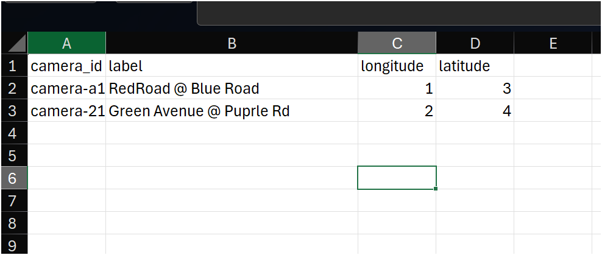

# CCTV GCC API - Urban Mobility Metrics

[](https://www.python.org/downloads/)
[](https://www.djangoproject.com/)
[](LICENSE)

A Django-based REST API for accessing urban mobility metrics derived from Glasgow City Council's CCTV network. This service provides object detection data including pedestrian, cyclist, and vehicle counts to support urban planning and research initiatives.

## Overview

The CCTV GCC API was initially developed by the [Urban Big Data Centre (UBDC)](https://www.ubdc.ac.uk/) and is now operated by Glasgow City Council. It provides structured access to hourly mobility data extracted from CCTV footage across Glasgow, enabling researchers, data scientists, and urban planners to analyze movement patterns and trends.

Please note that the service is desgined to hide any records that assosiated with incomplete cameras (ie missing label, longitude or latitude)

## Features

Object Detection Metrics: Access granular counts for multiple object classes, including:
- Pedestrians
- Cyclists
- Vehicles (cars, buses, trucks)

Spatio-Temporal Filtering: Query data by specific date ranges, times of day, and camera locations.

Standardized Output: Data is returned in structured

Integration Ready: Lightweight architecture designed to be easily integrated into larger Python-based data workflows or dashboards

## Getting Started

The following is regarding on the service. For how to consume the data please refer bellow. 

### Software

### Prerequisites

- [Python 3.11+](https://www.python.org/downloads/)
- [uv](https://docs.astral.sh/uv/getting-started/installation/) - Python package installer
- [Task](https://taskfile.dev/docs/installation) - Task runner
- [Docker](https://www.docker.com/get-started/) (optional, for containerized deployment)

To evolve the code you will need familiriatiy of python and the Django ecosystem. 

#### 1. Clone the Reposirory

~~~bash
git clone https://github.com/urbanbigdatacentre/cctv-gcc-api.git
cd cctv-gcc-api
~~~

2. **Start the development server**

```bash
task start-dev-server
```

The API will be available at `http://localhost:8000`

### Docker Deployment

For containerized deployment:

```bash
docker compose up -d
```

## Data Ingestion

Data is generated by an external detection engine (contact your administrator for details). There are multiple ways to ingest data:

### 1. Web Interface

Navigate to `/upload_report` in your browser:


1. Enter your security PIN
2. Optionally check "Overwrite existing records"
3. Drag & drop or browse for CSV.GZ files
4. Click "Upload Reports"

### 2. API Endpoint

Upload data programmatically via POST request:

```bash
curl -X POST http://localhost:8000/upload_report \
  -F "file=@/path/to/report.csv.gz" \
  -F "pin-code=YOUR_PIN" \
  -F "overwrite=false"
```

### 3. Command Line

Use the built-in management command:

```bash
task add-csv:/path/to/report.csv.gz
```

## Camera Management

### Adding New Cameras

New cameras are automatically created when their data is first ingested. However, they remain disabled until location and label information is provided.

**Workflow:**

1. **Export camera data to Excel**
   ```bash
   task syncdata
   ```

2. **Edit the generated Excel file**
   
   Add missing information for each camera:
   - `camera_id`: Unique identifier (auto-generated)
   - `label`: Descriptive name/location
   - `longitude`: Camera longitude (EPSG:4326)
   - `latitude`: Camera latitude (EPSG:4326)

   

3. **Import updated data**
   ```bash
   task syncdata
   ```
   
   The system will update camera records and enable those with complete information.

### Camera Data Requirements

A camera is considered **complete** and will have its data served when:
- ✅ Label is provided
- ✅ Longitude is provided
- ✅ Latitude is provided

Incomplete cameras have their records automatically filtered from API responses.

##  Development

### Project Structure

```
cctv-gcc-api/
├── cctv_api/           # Project Root
    ├── cctv_core/           # Django project settings
    ├── cctv_records/       # Main application 
    └── cctv_api            # API application
├── Taskfile.yml        # Task definitions
└── docker-compose.yml  # Docker configuration
```

### Available Models

- **YOLORecords**: Object detection using YOLO model
  - Fields: cars, pedestrians, cyclists, motorcycles, buses, lorries, vans, taxis
  
- **TF2Records**: Object detection using TensorFlow 2 model
  - Fields: cars, persons, bicycles, motorcycles, buses, trucks

- **Cameras**: Camera location and metadata
- **RecordsFilter**: Temporal filtering rules

### Technology Stack

- **Backend**: Django 5.0+, Django REST Framework
- **Database**: SQLite (development), PostgreSQL (production)
- **Task Runner**: Taskfile
- **Package Manager**: uv
- **Containerization**: Docker, Docker Compose

## API Documentation

API documentation is available at:
- Swagger UI: `/docs/`

### Example Request

```python
import requests

response = requests.get(
    'http://localhost:8000/api/records/yolo/',
    params={
        'camera_id': 'cam001',
        'from_date': '2024-01-01',
        'to_date': '2024-01-31',
    }
)

data = response.json()
```

## License

This project is licensed under the MIT License - see the [LICENSE](./LICENSE) file for details.

## Support

For issues, questions, or support:
- Open an issue on [GitHub Issues](https://github.com/urbanbigdatacentre/cctv-gcc-api/issues)
- Contact your system administrator
- Visit [UBDC](https://www.ubdc.ac.uk/)

## Credits

**Developed by**: [Urban Big Data Centre (UBDC)](https://www.ubdc.ac.uk/)
**Operated by**: Glasgow City Council  
**Initial Purpose**: Making urban mobility data accessible for research and planning

---

© 2024 Urban Big Data Centre. All rights reserved.